# Unterbrechungszähler / Interrupt Counter

> [!WARNING]
> **KI-Hinweis:** Dieses Projekt wurde maßgeblich mit Unterstützung von KI erstellt, anschließend aber praktisch getestet, überarbeitet und weiterentwickelt. Wer KI-generierten Code grundsätzlich nicht mag, darf natürlich trotzdem den Taster drücken. ;-)

> **Aktueller Stand:** `3.0.0`

[Deutsch](docs/de/README.md) · [English](docs/en/README.md) · [Schwäbisch](docs/swg/README.md)

---

## Für was brauche ich das Ding?

**Du sitzt konzentriert an einer Aufgabe.**

- Dann kommt ein Kollege.  
- Dann klingelt das Telefon.  
- Dann braucht jemand „nur ganz kurz“ etwas.  
- Dann kommt der Chef.  
- Und irgendwann fragst du dich, was du eigentlich vor zwei Stunden machen wolltest.

Genau dafür gibt es den **Unterbrechungszähler**.

**Taster drücken → Zeitpunkt speichern → später im Browser auswerten.**

Damit ist es nicht mehr nur ein Gefühl wie:

> „Heute bin ich irgendwie zu nichts gekommen.“

Sondern du kannst tatsächlich sehen, **wie oft und wann du unterbrochen wurdest**.

> [!WARNING]
> Ob das deinen Chef anschließend interessiert, ist natürlich eine völlig andere wissenschaftliche Fragestellung. ;-)

## Kann das Ding noch mehr?

Ja.

Der Unterbrechungszähler ist technisch gesehen nicht auf einen Taster beschränkt.

Anstelle des Tasters kannst du praktisch jeden geeigneten **potentialfreien Kontakt** verwenden.

Zum Beispiel:

- Störmeldung einer Maschine über einen Relaiskontakt
- Unterbrechung einer Lichtschranke
- Tür- oder Fensterkontakt
- Schaltkontakt einer Anlage
- Betriebs- oder Fehlermeldungen
- Kontakt eines externen Tasters
- oder irgendeinen anderen Kontakt, bei dem du später wissen möchtest: **Wann ist das eigentlich passiert?**

Kurz gesagt:

**Kontakt schaltet → Ereignis wird gespeichert → Daten werden visualisiert.**

Sei kreativ.

Wenn jemand das Projekt irgendwann benutzt, um die Öffnungen des Kühlschranks zu zählen, möchte ich davon allerdings erfahren.

---

## Warum habe ich das gemacht?

Über die Jahre hat sich bei uns im Unternehmen einiges verändert.

- Wir bekamen mehr Mitarbeiter.
- Dann mehr Aufgaben.
- Dann noch mehr Mitarbeiter.
- Dann noch mehr Aufgaben.

Und wenn die wirtschaftliche Lage schwieriger wird, kennt vermutlich jeder das bewährte Managementkonzept:

- **Noch mehr Aufgaben.**

Irgendwann hatte ich das Gefühl, keinen klaren Gedanken mehr fassen zu können – geschweige denn, eine Aufgabe von vielleicht 60 Minuten einmal konzentriert und ohne Unterbrechung fertigzustellen.

Das Problem:

In einem größeren Unternehmen reicht

> „So kann ich nicht vernünftig arbeiten.“

als Argument irgendwann nicht mehr unbedingt aus.

Also entstand die Idee, etwas zurückzugeben, das große Unternehmen besonders lieben:

**Daten, Statistiken, Dokumentation und Auswertungen.**

Oder anders gesagt:

Ich setze die Bürokratie- und Dokumentationswut einfach gegen das System ein. ;-)

Da mein Arbeitstag allerdings ohnehin schon genug Chaos enthält, durfte daraus natürlich keine zusätzliche Verwaltungsaufgabe entstehen.

Die wichtigste Anforderung war deshalb von Anfang an:

**Ein Knopfdruck. Fertig.**

Keine App öffnen.  
Kein Formular ausfüllen.  
Keine Kategorie auswählen.  
Keine Excel-Liste pflegen.

Einfach drücken und weiterarbeiten.

Den Rest macht das Gerät.

---

## Was kann das Gerät?

- **Ereignisse per Taster oder potentialfreiem Kontakt erfassen**  
  Einfach, schnell und ohne jedes Mal einen Verwaltungsakt daraus zu machen.

- **Lokale Weboberfläche ohne Cloud**  
  Sehr wichtig. Nicht alles muss erst einmal über drei Rechenzentren geschickt werden, nur damit man einen Knopf zählen kann. ;-)

- **Tagesansicht, Verlauf, Details und Heatmaps**  
  Damit man schnell sieht, wann besonders viel los war – oder wann offenbar alle anderen Mittagspause hatten.

- **CSV-Export und Langzeit-Ringspeicher**  
  Falls aus „Ich werde ständig unterbrochen“ irgendwann „Zeig mir die Daten“ wird.

- **DS3231-RTC**  
  Damit das Gerät auch ohne WLAN weiß, wie spät es ist. Revolutionäre Technik.

- **Optionales SH1106-OLED mit 128 × 64 Pixeln**  
  Technisch nicht zwingend notwendig, sieht aber sofort mindestens 37 % professioneller aus.

- **Fallback-WLAN für lokalen Zugriff**  
  Wer keine Cloud möchte, sollte das Gerät schließlich trotzdem noch erreichen können.

- **Deutsch, Englisch, Italienisch, Französisch, Schwäbisch, Alb-Schwäbisch und Oberschwäbisch in der Oberfläche**  
  Die README-Dokumentation gibt es bewusst nur in Deutsch, Englisch und Schwäbisch. Internationalisierung muss schließlich irgendwo anfangen.

- **MagSafe-Ring für Akku oder Halterungen**  
  Weil Klettband zwar funktioniert, aber Magnete einfach mehr nach Zukunft aussehen.

## 3.0.0 ist ein harter Schnitt

Die bisherigen 1.x/2.x-Stände waren Entwicklungs- und Teststände. **3.0.0 ist der neue Ausgangspunkt.** Es gibt deshalb keine zugesicherte Hardware-, Daten- oder OTA-Migration von 2.x. Wer von einem alten Testaufbau kommt, baut die Verdrahtung nach der aktuellen 3.0.0-Dokumentation neu auf.

## Aktuelle Pinbelegung

| Funktion | ESP32 |
|---|---:|
| Unterbrechungstaster / DI1 | GPIO13 gegen GND |
| I2C SDA – RTC + OLED | GPIO21 |
| I2C SCL – RTC + OLED | GPIO22 |
| DY-SV17F TX → ESP32 RX | GPIO18 |
| ESP32 TX → DY-SV17F RX | GPIO19 |
| DY-SV17F CON3/BUSY | GPIO39 / VN |

Für CON3/BUSY ist ein externer ca. **10-kΩ-Pull-up an V33 des DY-SV17F** erforderlich. CON1 und CON2 liegen für den UART-Modus auf GND. Details: [Hardware / Wiring](docs/de/HARDWARE.md).

## Schnellstart

1. [Hardware und Verdrahtung](docs/de/HARDWARE.md)
2. [Software, Build und Flashen](docs/de/SOFTWARE.md)
3. WLAN-Platzhalter in `Unterbrechungszaehler/config.h` lokal anpassen.
4. `Unterbrechungszaehler/Unterbrechungszaehler.ino` in der Arduino IDE öffnen.
5. **ESP32 Dev Module** auswählen, kompilieren und flashen.
6. Taster drücken. Falls dich niemand unterbricht, war der Aufbau vermutlich zu erfolgreich.

## Technische Dokumentation

- [Sketch-Dokumentation](Unterbrechungszaehler/README.md)
- [Hardware-Wiring](Unterbrechungszaehler/HARDWARE_WIRING.md)
- [Architektur](Unterbrechungszaehler/PROJECT_ARCHITECTURE.md)
- [Speicherformat](Unterbrechungszaehler/STORAGE_FORMAT.md)
- [Zeitarchitektur](Unterbrechungszaehler/TIME_ARCHITECTURE.md)
- [Testbericht](Unterbrechungszaehler/TEST_REPORT.md)
- [Changelog](CHANGELOG.md)

## Screenshots

Die finalen Screenshots werden separat ergänzt. Vorgesehene Dateien unter `docs/images/`:

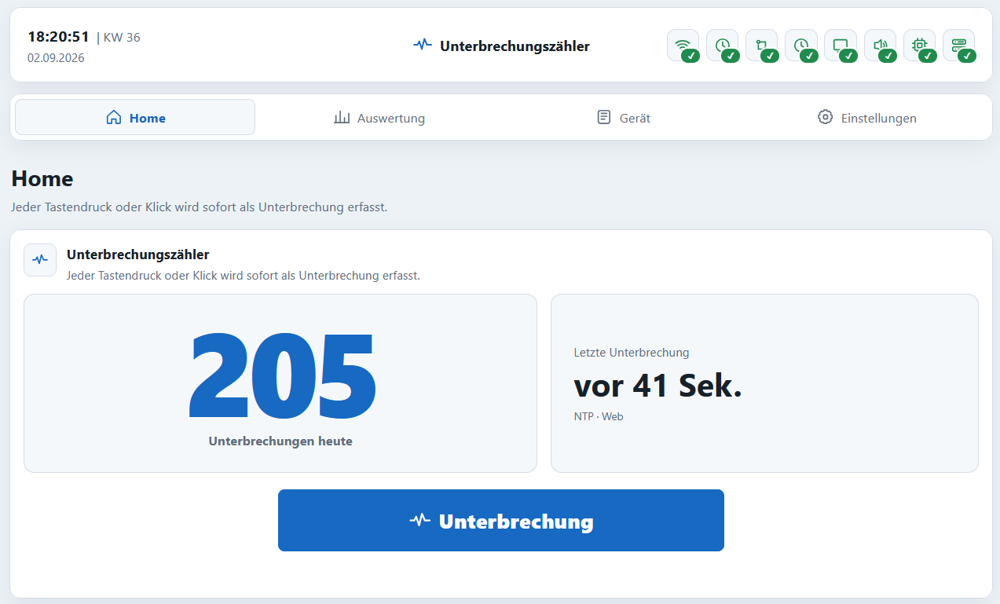

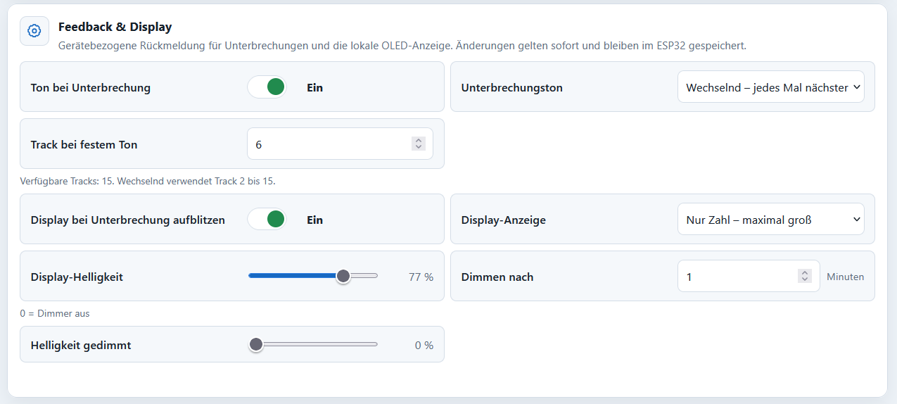

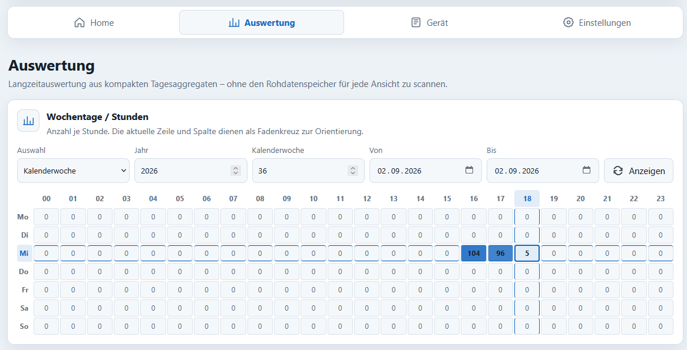

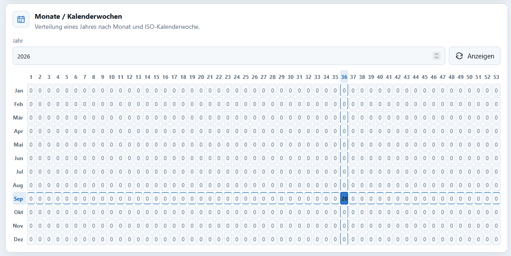

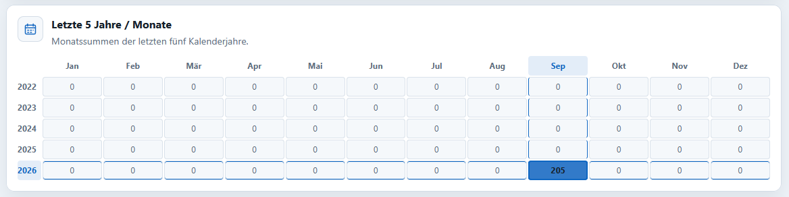

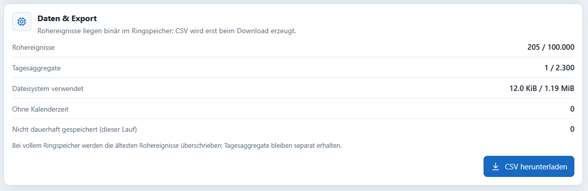

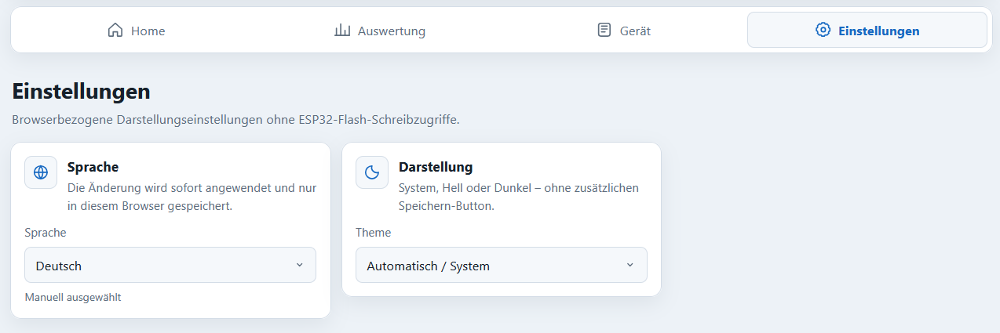

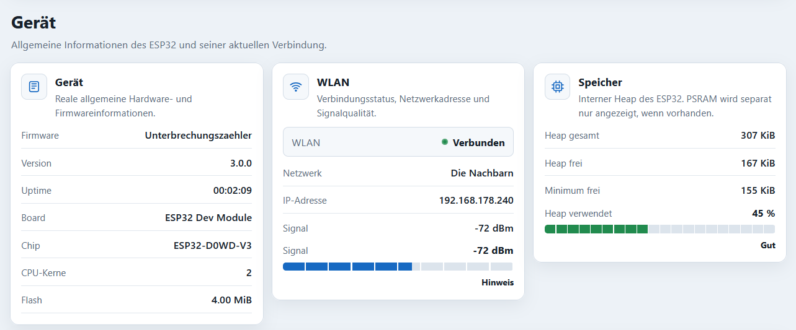

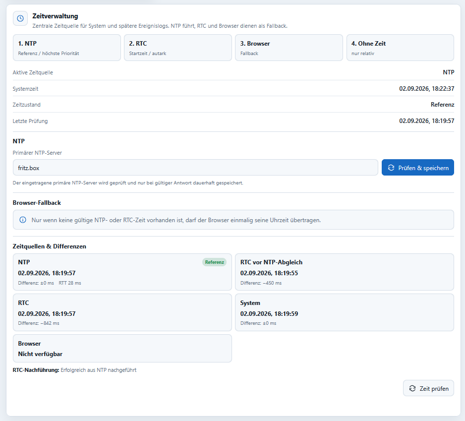

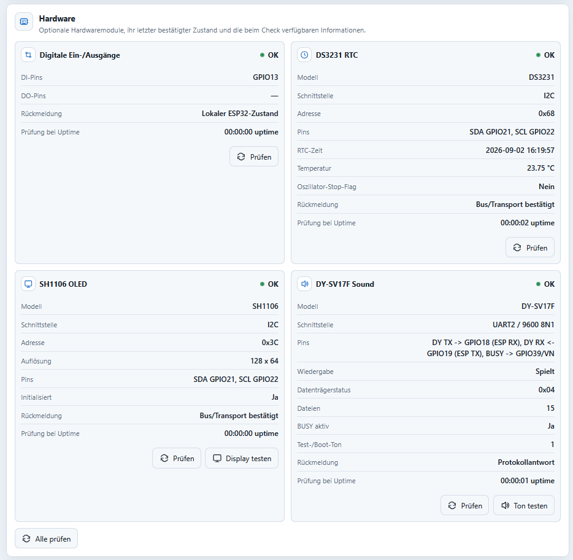

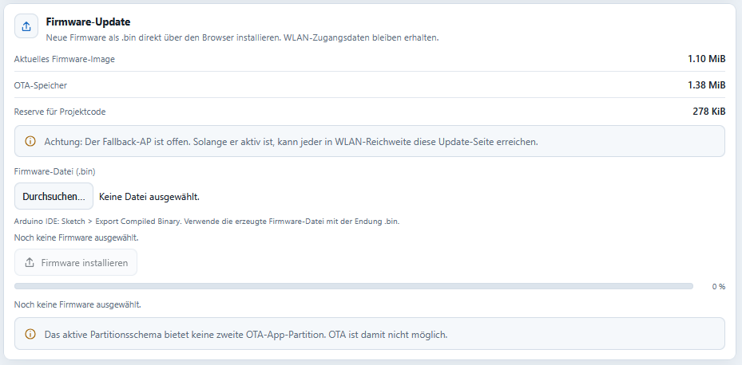

## Warum Schwäbisch?

Weil technische Projekte nicht immer komplett ernst sein müssen.

Software darf funktionieren **und** trotzdem ein bisschen Persönlichkeit haben.

Ich mag Schwäbisch und wollte außerdem irgendwo ein kleines Easter Egg einbauen.

Also gibt es die Oberfläche auch auf Schwäbisch – inzwischen sogar zusätzlich als Alb-Schwäbisch und Oberschwäbisch.

Ob das die internationale Verbreitung des Projekts beschleunigt oder massiv behindert, wird die Zukunft zeigen.

## Lizenz

MIT. Benutzen, verändern, erweitern und daraus etwas Eigenes bauen ist ausdrücklich erlaubt. Wenn daraus irgendwann ein millionenschweres Produkt entsteht, freue ich mich weiterhin über eine Postkarte.

GitHub: [taloriko](https://github.com/taloriko)
